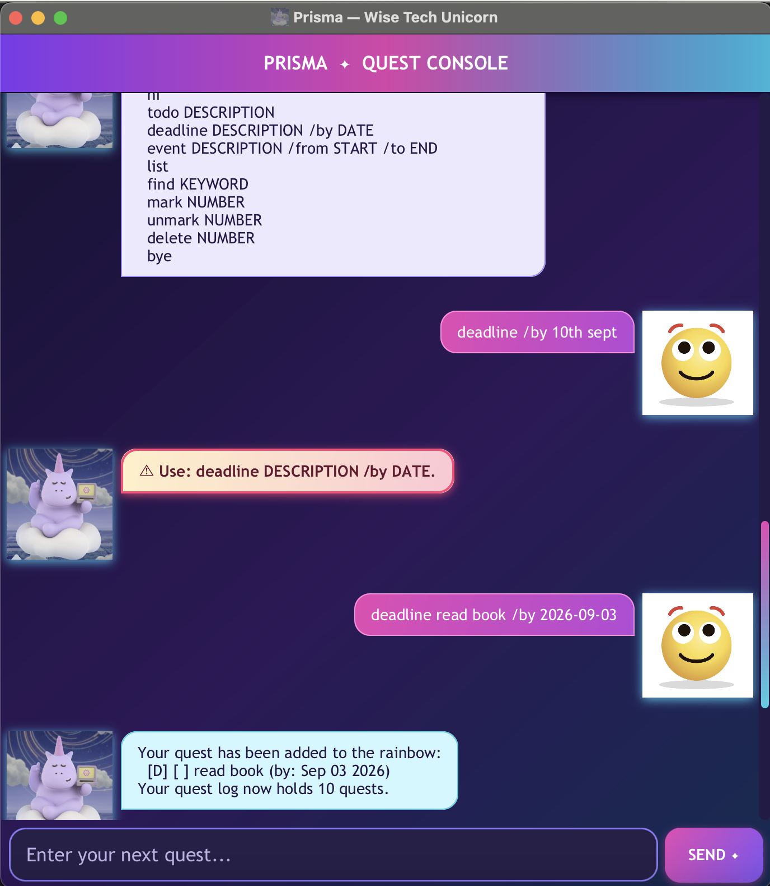

# Prisma User Guide

Prisma is a colorful, wise tech-unicorn chatbot that helps you manage todos, deadlines, and events through
simple text commands.



## Quick start

1. Ensure that Java 25 is installed on your computer.
2. Place `unicorn.jar` in the folder where you want Prisma to store its data.
3. Open a terminal in that folder and run:

   ```shell
   java -jar unicorn.jar
   ```

4. Enter a command in the text field and press <kbd>Enter</kbd> or select **SEND ✦**.
5. Start with `hi` whenever you want to see the available commands.

> **Tip:** Commands are lowercase. Words such as `DESCRIPTION`, `DATE`, and `NUMBER` in this guide are placeholders;
> replace them with your own details.

## Features

### Viewing available commands: `hi`

Use `hi` to greet Prisma and display a list of supported commands.

```text
hi
```

### Adding a todo: `todo`

Adds a task without a date or time.

**Format:** `todo DESCRIPTION`

```text
todo read book
```

### Adding a deadline: `deadline`

Adds a task that must be completed by a specific date or date and time.

**Format:** `deadline DESCRIPTION /by DATE`

Prisma accepts these date formats:

- `yyyy-MM-dd`, for example `2026-09-30`
- `yyyy-MM-dd HHmm`, for example `2026-09-30 1830`
- `d/M/yyyy HHmm`, for example `30/9/2026 1830`

```text
deadline submit report /by 2026-09-30 1830
```

The `/by` marker must appear exactly once.

### Adding an event: `event`

Adds a task with a start and end. The time details can be short phrases such as `2pm`, `Monday`, or
`Science Library`.

**Format:** `event DESCRIPTION /from START /to END`

```text
event project meeting /from Monday 2pm /to Monday 3pm
```

Both markers are required, must appear exactly once, and must be written in the order `/from` then `/to`.

### Listing tasks: `list`

Displays every task and its current number.

```text
list
```

An unchecked box `[ ]` means that the task is incomplete, while `[X]` means that it is complete. Use the
numbers shown by `list` with `mark`, `unmark`, and `delete`.

### Finding tasks: `find`

Displays tasks whose descriptions contain the keyword. The search is not case-sensitive.

**Format:** `find KEYWORD`

```text
find report
```

### Marking a task as complete: `mark`

**Format:** `mark NUMBER`

```text
mark 2
```

This marks task 2 from the full task list as complete.

### Marking a task as incomplete: `unmark`

**Format:** `unmark NUMBER`

```text
unmark 2
```

This returns task 2 to its incomplete state.

### Deleting a task: `delete`

**Format:** `delete NUMBER`

```text
delete 2
```

This permanently removes task 2 from the list. Run `list` first if you are unsure of its current number.

### Exiting Prisma: `bye`

Closes the application.

```text
bye
```

## Saving data

Prisma saves changes automatically after you add, mark, unmark, or delete a task. The data is stored in
`data/unicorn.txt`, relative to the folder from which you launched the application. Prisma loads the saved tasks
the next time it starts.

> **Warning:** Do not edit the data file while Prisma is running. Invalid changes can prevent saved tasks from loading.

## Input errors

If a command is incomplete or incorrectly formatted, Prisma displays a highlighted warning beginning with `⚠`.
The task list is left unchanged, so you can correct the command and try again.

## Command summary

| Action | Command |
| --- | --- |
| Show command help | `hi` |
| Add a todo | `todo DESCRIPTION` |
| Add a deadline | `deadline DESCRIPTION /by DATE` |
| Add an event | `event DESCRIPTION /from START /to END` |
| Show all tasks | `list` |
| Find tasks | `find KEYWORD` |
| Mark a task complete | `mark NUMBER` |
| Mark a task incomplete | `unmark NUMBER` |
| Delete a task | `delete NUMBER` |
| Exit Prisma | `bye` |
